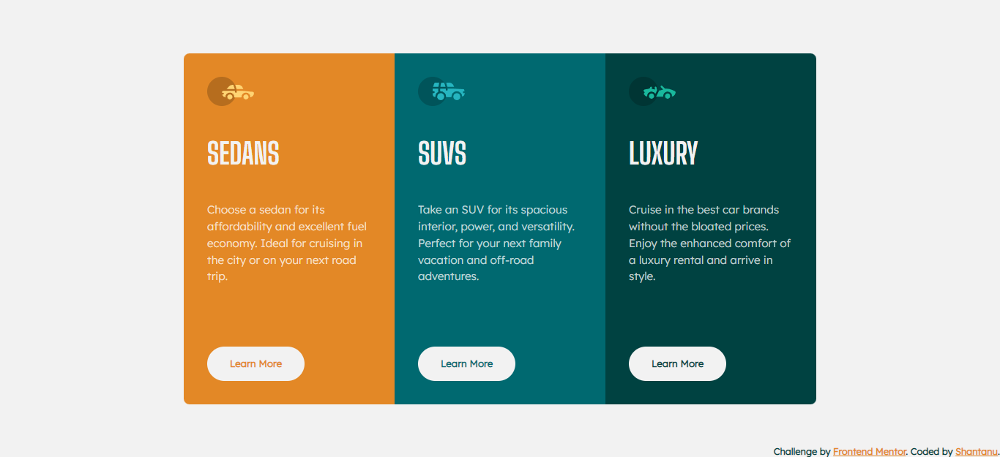

# Frontend Mentor - 3-column preview card component

This is a solution to the [3-column preview card component challenge on Frontend Mentor](https://www.frontendmentor.io/challenges/3column-preview-card-component-pH92eAR2-). Frontend Mentor challenges help you improve your coding skills by building realistic projects. 

## Table of contents

- [Overview](#overview)
  - [The challenge](#the-challenge)
  - [Screenshot](#screenshot)
  - [Links](#links)
- [My process](#my-process)
  - [Built with](#built-with)
  - [What I learned](#what-i-learned)
- [Author](#author)

## Overview

### The challenge

Users should be able to:

- View the optimal layout depending on their device's screen size
- See hover states for interactive elements

### Screenshot




### Links

- Solution URL: [3-Column preview card component](https://github.com/shantanufsd/frontend-mentor-challenges/tree/main/3-column-preview-card-component)
- Live Site URL: [View](https://shantanufsd.github.io/frontend-mentor-challenges/3-column-preview-card-component)

## My process

### Built with

- Semantic HTML5 markup
- CSS Grid
- CSS custom properties

### What I learned

1. I learned to use CSS custom properties.
```css
:root{
    --bright-orange: hsl(31, 77%, 52%);
    --card-padding: 2em;
}

.sedan-card{
    background-color: var(--bright-orange);
    padding: var(--card-padding);
}
```

2. I learned to use CSS Grid
```css
.card-container{
    display: grid;
    grid-template: 30em/ repeat(3, 18em);
}
```

## Author

- Frontend Mentor - [@shantanufsd](https://www.frontendmentor.io/profile/shantanufsd)
- Twitter - [@shantanufsd](https://www.twitter.com/shantanufsd)