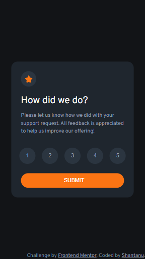
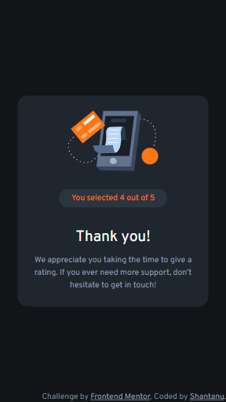

# Frontend Mentor - Interactive rating component solution

This is a solution to the [Interactive rating component challenge on Frontend Mentor](https://www.frontendmentor.io/challenges/interactive-rating-component-koxpeBUmI). Frontend Mentor challenges help you improve your coding skills by building realistic projects. 

## Table of contents

- [Overview](#overview)
  - [The challenge](#the-challenge)
  - [Screenshot](#screenshot)
  - [Links](#links)
- [My process](#my-process)
  - [Built with](#built-with)
  - [What I learned](#what-i-learned)
- [Author](#author)

## Overview

### The challenge

Users should be able to:

- View the optimal layout for the app depending on their device's screen size
- See hover states for all interactive elements on the page
- Select and submit a number rating
- See the "Thank you" card state after submitting a rating

### Screenshot






### Links

- Solution URL: [Interactive Rating Component](https://github.com/shantanufsd/frontend-mentor-challenges/tree/main/interactive-rating-component)
- Live Site URL: [View](https://shantanufsd.github.io/frontend-mentor-challenges/interactive-rating-component)

## My process

### Built with

- Semantic HTML5 markup
- Flexbox

### What I learned

I learned how to use Flexbox to create a responsive layout and align elements within a container. I also learned how to use JavaScript to change the visibility of elements and capture user input.

To see how you can add code snippets, see below:

```js
container.style.display = "none";
```

```js
for (let i = 0; i < rating.length; i++) {
  rating[i].addEventListener("click", () => {
    rateClick = rating[i].value;
  });
}
```

## Author

- Frontend Mentor - [@shantanupratap](https://www.frontendmentor.io/profile/shantanupratap)
- Twitter - [@shantanufsd](https://www.twitter.com/shantanufsd)

