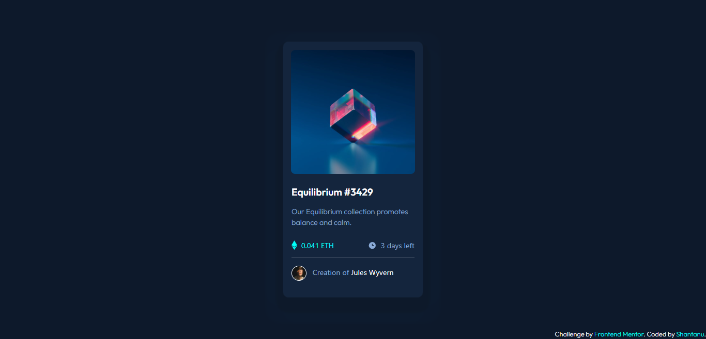

# Frontend Mentor - NFT preview card component solution

This is a solution to the [NFT preview card component challenge on Frontend Mentor](https://www.frontendmentor.io/challenges/nft-preview-card-component-SbdUL_w0U). Frontend Mentor challenges help you improve your coding skills by building realistic projects. 

## Table of contents

- [Overview](#overview)
  - [The challenge](#the-challenge)
  - [Screenshot](#screenshot)
  - [Links](#links)
- [My process](#my-process)
  - [Built with](#built-with)
  - [What I learned](#what-i-learned)
- [Author](#author)

## Overview

### The challenge

Users should be able to:

- View the optimal layout depending on their device's screen size
- See hover states for interactive elements

### Screenshot




### Links

- Solution URL: [NFT preview card component](https://github.com/shantanufsd/frontend-mentor-challenges/tree/main/nft-preview-card-component)
- Live Site URL: [View](https://shantanufsd.github.io/frontend-mentor-challenges/nft-preview-card-component)

## My process

### Built with

- Semantic HTML5 markup
- [Bootstrap](https://getbootstrap.com/) - CSS Framework

### What I learned

- To easily style the elements using Bootstrap classes.

```html
<main class="container d-flex justify-content-center align-items-center vh-100">
```

## Author

- Frontend Mentor - [@shantanupratap](https://www.frontendmentor.io/profile/shantanupratap)
- Twitter - [@shantanufsd](https://www.twitter.com/shantanufsd)


