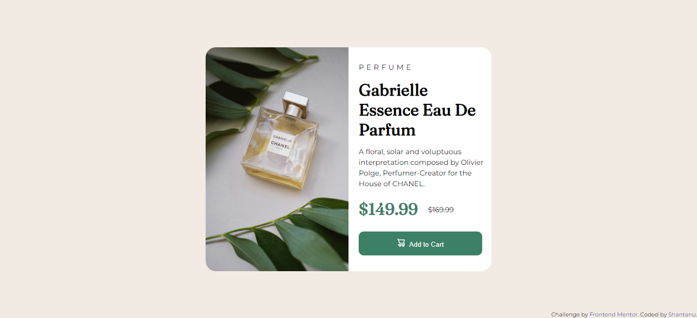

# Frontend Mentor - Product preview card component solution

This is a solution to the [Product preview card component challenge on Frontend Mentor](https://www.frontendmentor.io/challenges/product-preview-card-component-GO7UmttRfa). Frontend Mentor challenges help you improve your coding skills by building realistic projects. 

## Table of contents

- [Overview](#overview)
  - [The challenge](#the-challenge)
  - [Screenshot](#screenshot)
  - [Links](#links)
- [My process](#my-process)
  - [Built with](#built-with)
  - [What I learned](#what-i-learned)
- [Author](#author)


## Overview

### The challenge
Users should be able to:

- View the optimal layout depending on their device's screen size
- See hover and focus states for interactive elements

### Screenshot




### Links

- Solution URL: [product-preview-card-component](https://github.com/shantanufsd/frontend-mentor-challenges/tree/main/product-preview-card-component)
- Live Site URL: [View](https://shantanufsd.github.io/frontend-mentor-challenges/product-preview-card-component)

## My process

### Built with

- Semantic HTML5 markup
- CSS

### What I learned

1. To adapt the website's design to the screen size of the user's device.

```css

@media only screen and (max-width: 480px) {
    
}

@media only screen and (min-width: 481px and (max-width: 620px)) {
    
}

@media only screen and (min width: 621px) {
    
}

```

2. To center the div vertically and horizantally using position and margin property.

```css


  .container {
  position: absolute;
  top:50%;
  left:50%;
  margin: -220px 0 0 -280px;
}

```

## Author

- Frontend Mentor - [@shantanupratap](https://www.frontendmentor.io/profile/shantanupratap)
- Twitter - [shantanufsd](https://www.twitter.com/shantanufsd)

