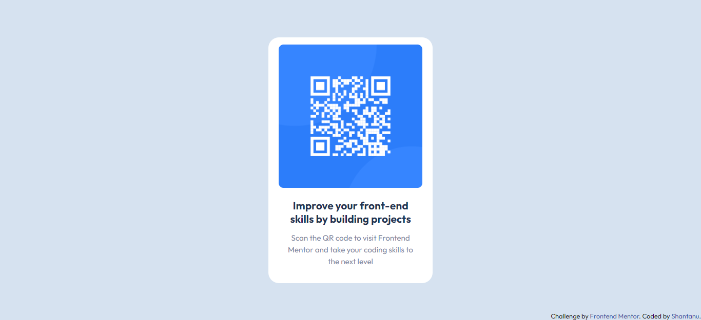

# Frontend Mentor - QR code component solution

This is a solution to the [QR code component challenge on Frontend Mentor](https://www.frontendmentor.io/challenges/qr-code-component-iux_sIO_H). Frontend Mentor challenges help you improve your coding skills by building realistic projects. 

## Table of contents

- [Overview](#overview)
  - [The challenge](#the-challenge)
  - [Screenshot](#screenshot)
  - [Links](#links)
- [My process](#my-process)
  - [Built with](#built-with)
  - [What I learned](#what-i-learned)
- [Author](#author)


## Overview

### The challenge
Users should be able to:

- View the optimal layout depending on their device's screen size

### Screenshot




### Links

- Solution URL: [QR Code Component](https://github.com/shantanufsd/frontend-mentor-challenges/tree/main/qr-code-component)
- Live Site URL: [View](https://shantanufsd.github.io/frontend-mentor-challenges/qr-code-component)

## My process

### Built with

- Semantic HTML5 markup
- Flexbox

### What I learned

 * To center the div vertically and horizantally using Flexbox.

```css


 html,body{
    background-color: hsl(212, 45%, 89%);
    height:100%;
    display: flex;
    justify-content: center;
    align-items: center;
}


```

## Author

- Frontend Mentor - [@shantanufsd](https://www.frontendmentor.io/profile/shantanufsd)
- Twitter - [@shantanufsd](https://www.twitter.com/shantanufsd)

